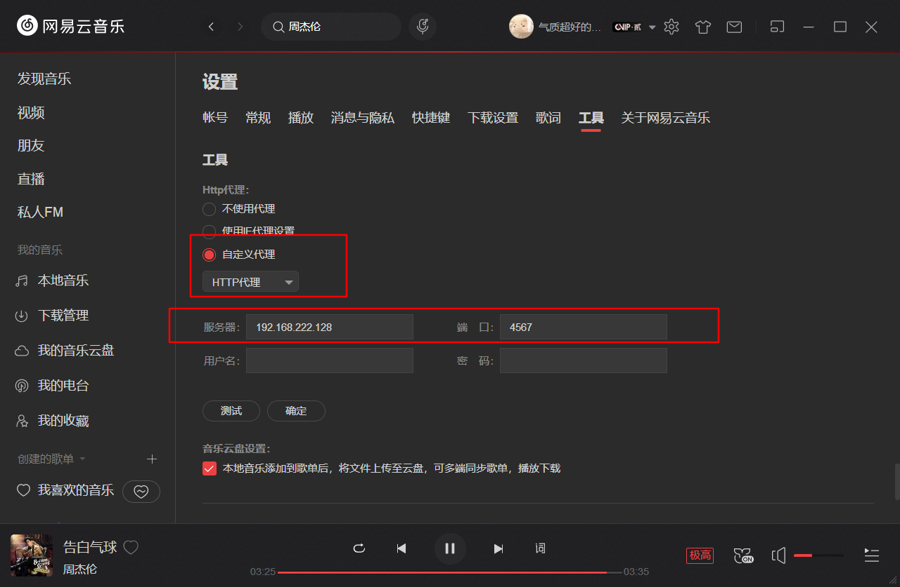

# Docker 安装 UnblockNeteaseMusic

## 项目简介

**UnblockNeteaseMusic**

解锁网易云音乐客户端变灰歌曲


nondanee/unblockneteasemusic


**Docker Pull Command**

```
docker pull nondanee/unblockneteasemusic
```

## 安装运行 <a href="#la-qu-yun-hang-jing-xiang" id="la-qu-yun-hang-jing-xiang"></a>

```
docker run --name yunmusic -d -p 4567:8080 nondanee/unblockneteasemusic
```

## 相关设置 <a href="#windows-duan-she-zhi" id="windows-duan-she-zhi"></a>

* **修改Hosts**

Windows下找到`Hosts`路径：

Windows系统：位于C:\Windows\System32\drivers\etc\hosts

向 hosts 文件添加两条规则：

```
<Server IP> music.163.com
<Server IP> interface.music.163.com
```

* **客户端设置**


